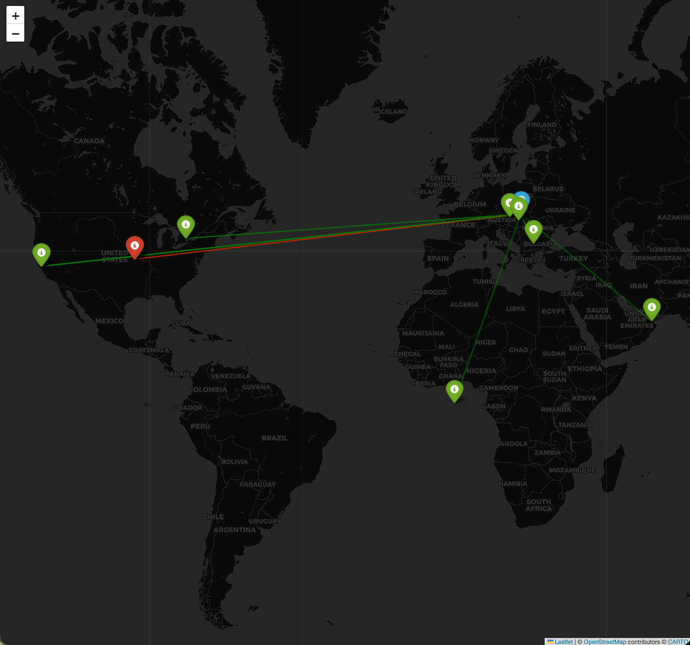
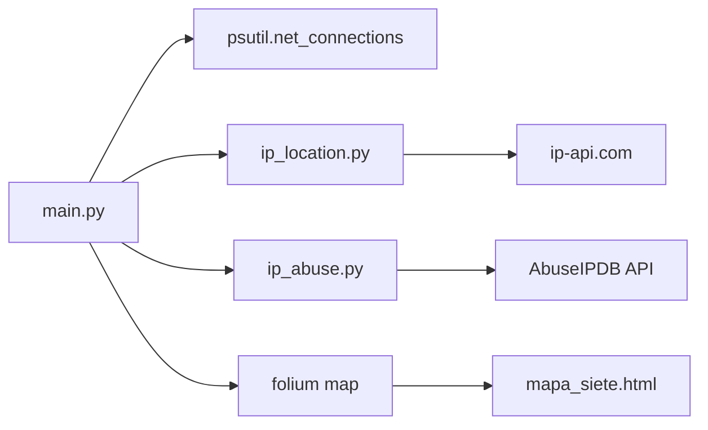

# Threat Intelligence Dashboard

A lightweight Python project that scans active outbound network connections, geolocates remote IPs, checks their reputation with AbuseIPDB, and renders everything on an interactive map.



## Why this project

This tool helps you quickly answer:
- Which remote servers is my machine connected to right now?
- Where are those endpoints geographically?
- Which endpoints look suspicious based on abuse reputation?

It is useful for personal threat-hunting demos, SOC portfolio projects, and network visibility labs.

## Features

- Live collection of active internet connections (`psutil`)
- IP geolocation (city/country + coordinates) via `ip-api.com`
- Threat scoring (`0-100`) via AbuseIPDB API
- Visual risk highlighting on map:
  - Green marker/line = lower risk
  - Red marker/line = higher risk (score > 20)
- Single-file interactive map output: `mapa_siete.html`

## Architecture



## Project structure

```text
Threat-Intelligence-Dashboard/
├── main.py              # Entry point and map generation
├── ip_location.py       # Geolocation lookup
├── ip_abuse.py          # AbuseIPDB reputation lookup
├── requirements.txt
├── .env.example
├── assets/
│   └── map-preview.svg
└── mapa_siete.html      # Generated output (example)
```

## Prerequisites

- Python 3.10+ (tested in your workspace with Python 3.14 environment)
- Internet access for API calls
- Optional: AbuseIPDB API key (without it, threat scores default to 0)

## Installation

```bash
python3 -m venv .venv
source .venv/bin/activate
pip install --upgrade pip
pip install -r requirements.txt
```

## Configuration

1. Copy environment template:

```bash
cp .env.example .env
```

2. Edit `.env` and insert your key:

```dotenv
ABUSEIPDB_API_KEY=your_abuseipdb_api_key_here
```

> Keep `.env` private. Never commit real API keys.

## Run

```bash
python3 main.py
```

Expected behavior:
- Scans active network connections
- Resolves remote IP locations
- Pulls abuse scores
- Generates `mapa_siete.html`

Open the output map in your browser:

```bash
open mapa_siete.html
```

## Visualization output

- Preview image: `assets/map-preview.svg`
- Real interactive result: `mapa_siete.html`

The interactive HTML includes click-able markers with:
- City and country
- IP address
- Threat score percentage

## Security and privacy notes

- This project inspects active network connections on your local machine.
- Geolocation is approximate and based on public IP intelligence.
- Abuse scores are external reputation signals, not proof of compromise.
- Rotate your API key immediately if it has ever been exposed publicly.
- Consider running with elevated permissions only when necessary.

## Troubleshooting

- `AccessDenied` / permission error:
  - Re-run with elevated privileges (`sudo`) if required by your OS policy.
- All threat scores are `0`:
  - Verify `ABUSEIPDB_API_KEY` is set correctly in `.env`.
- Empty or incomplete map:
  - Ensure there are active remote connections when running scan.
- API/network failures:
  - Check internet connectivity and third-party API availability.

## Roadmap ideas

- Add CLI flags (risk threshold, max connections, output file)
- Export results to CSV/JSON
- Add unit tests for IP filtering and scoring logic
- Add optional DNS/domain enrichment
- Containerize with Docker

## License

This repository is provided under the MIT License. See [LICENSE](LICENSE).

## Author

Built by Samuel Sugra as a cybersecurity portfolio project.

# Threat-Intelligence-Dashboard
# Threat-Intelligence-Dashboard
